<p align="center">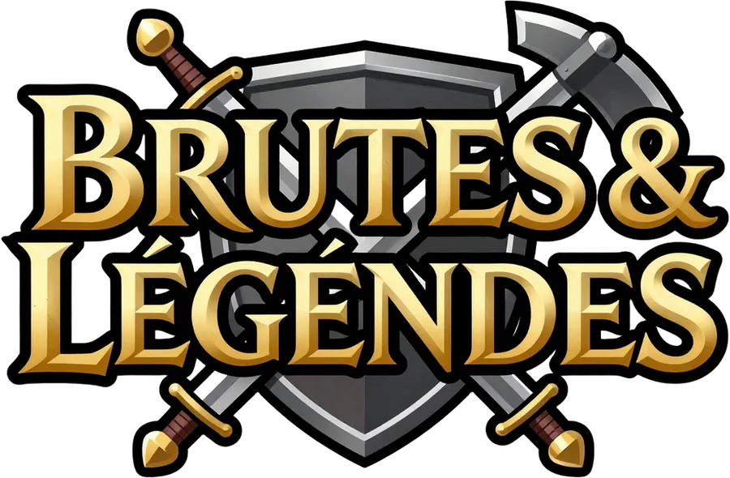</p>

<h3 align="center">ValorBrawl — Brutes &amp; Légendes</h3>
<p align="center">Jeu multijoueur de combats automatiques façon <i>La Brute</i>, en version médiéval fantastique.<br>
Client <b>Godot 4.7</b> (Windows), serveur <b>Node.js</b>, graphismes, sons, musiques et bande-annonce générés avec <b>ComfyUI</b>.</p>

<p align="center">
  <a href="http://51.254.211.144/test-labrute/">Site du jeu</a> ·
  <a href="http://51.254.211.144/test-labrute/downloads/BrutesEtLegendes-Windows.zip">Télécharger pour Windows</a>
</p>

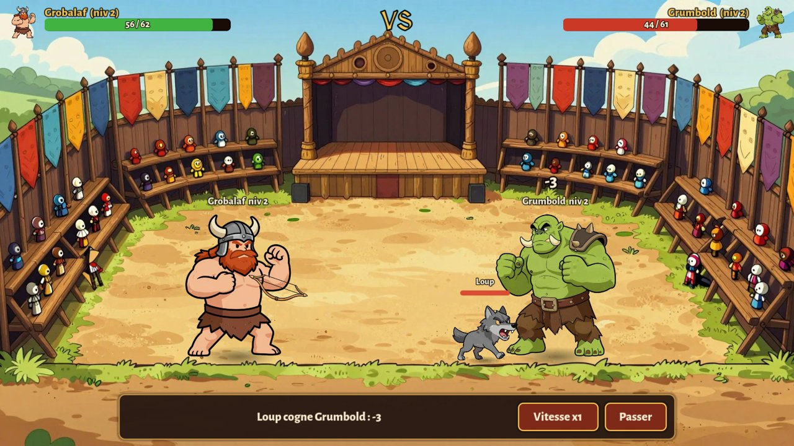

## Le jeu

Crée ta brute (nom + apparence) : les dieux de l'arène tirent au sort ses caractéristiques et un premier bonus
(arme, compétence ou familier). Les combats sont **automatiques** : le serveur les simule, le client les rejoue avec
animations, projectiles, chiffres de dégâts, sons et commentaires. À chaque niveau, tu choisis un bonus parmi deux.

| | |
|---|---|
| 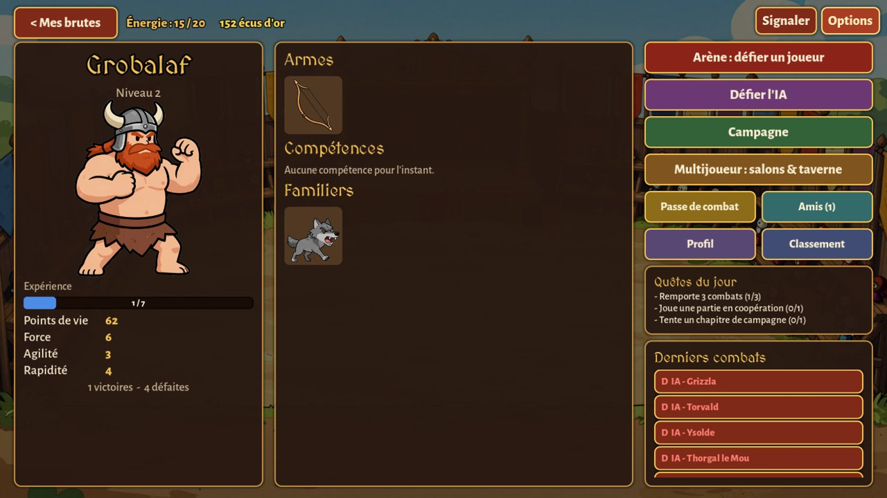 | 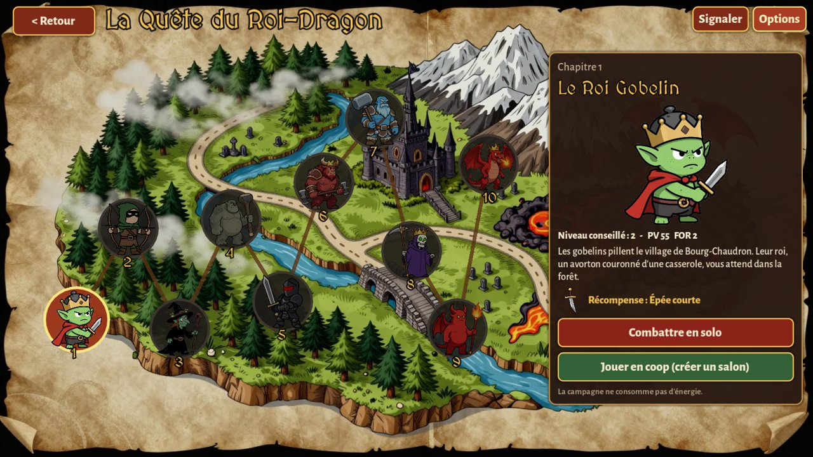 |
| 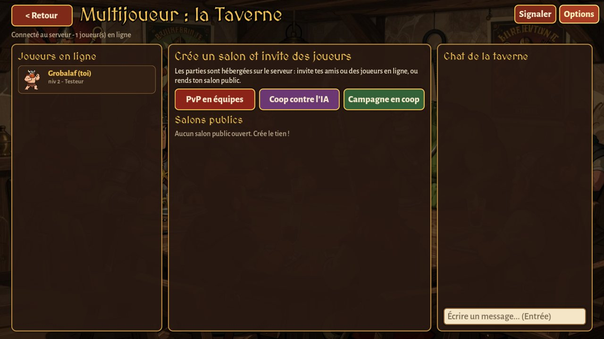 | 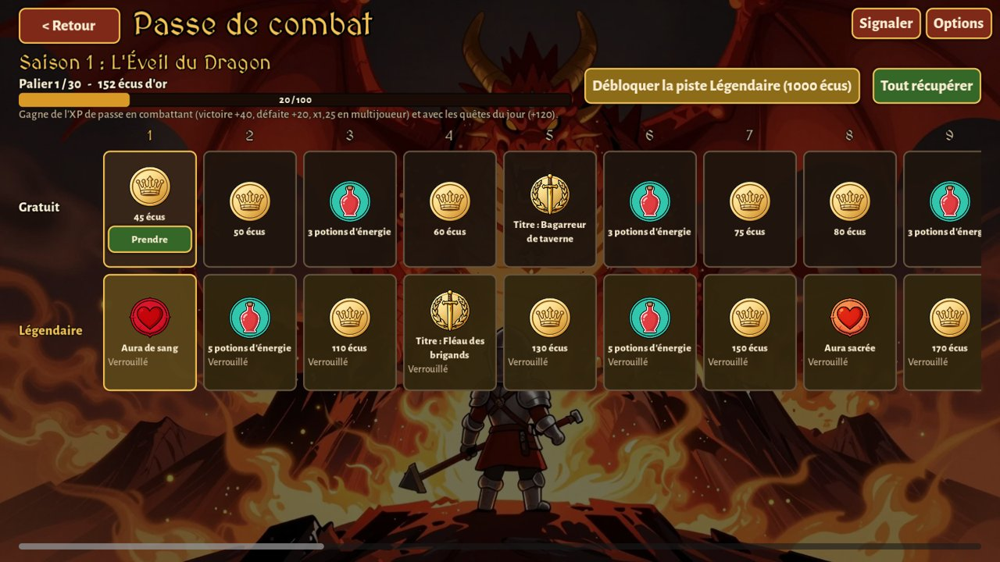 |
| 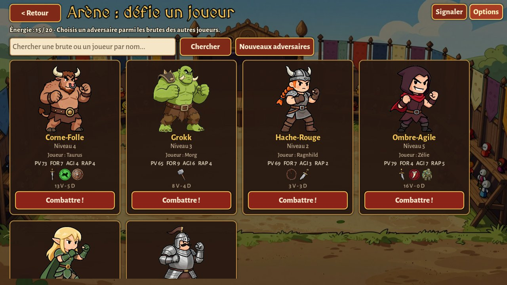 | 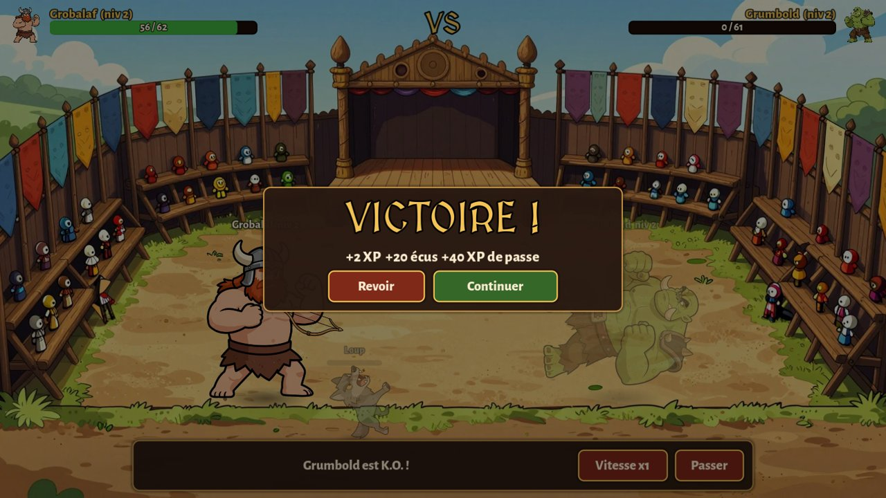 |

### Modes
- **Arène PvP** : défie les brutes des autres joueurs, recherche par nom.
- **Défier l'IA** : Facile, Normal, Difficile, Légendaire.
- **Campagne** « La Quête du Roi-Dragon » : 10 chapitres, 10 boss, récompenses uniques.
- **Salons hébergés sur le serveur** : PvP en équipes (jusqu'à 3 contre 3), **coop contre l'IA**, **campagne en coop**
  (boss renforcé selon le nombre de joueurs). Salons publics ou privés, invitations d'amis ou de joueurs en ligne,
  chat de salon, duel direct.
- **Passe de combat** saisonnier : 30 paliers, piste gratuite + piste Légendaire (débloquée avec les écus gagnés en jeu),
  quêtes du jour, auras et titres.
- **Amis** (demandes, statut en ligne, défi, invitation), **profil** (avatar, devise, titre, aura, mot de passe),
  **classement**, **bugs & suggestions** (signalement en jeu, votes « Moi aussi », commentaires, statut).

### Contenu
8 apparences, 16 armes, 18 compétences (passives et « supers »), 4 familiers, 10 boss, 10 arènes.

<p align="center">
  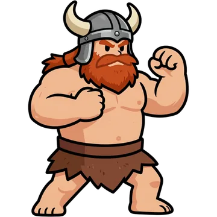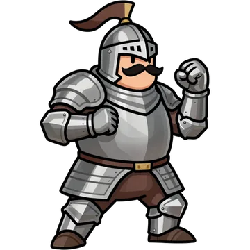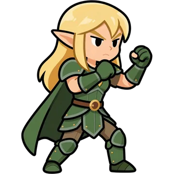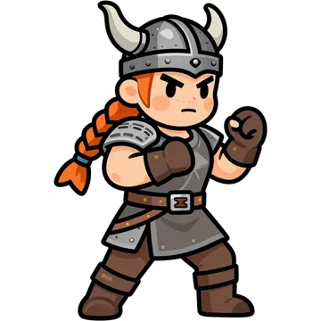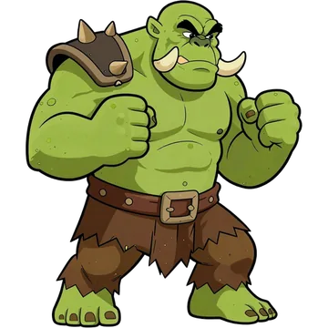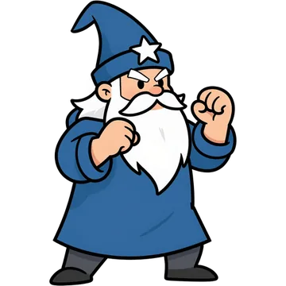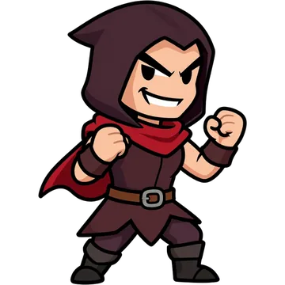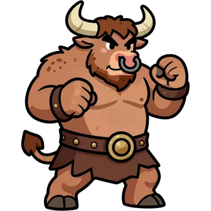
</p>
<p align="center">
  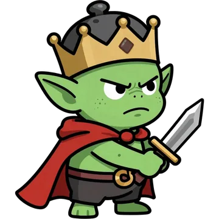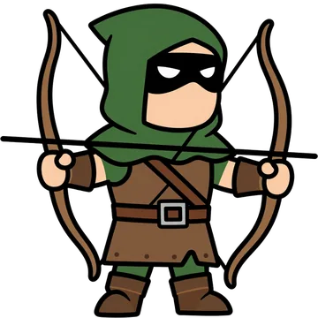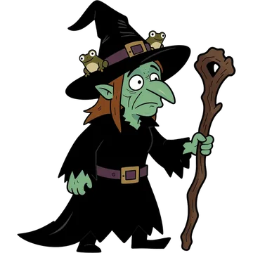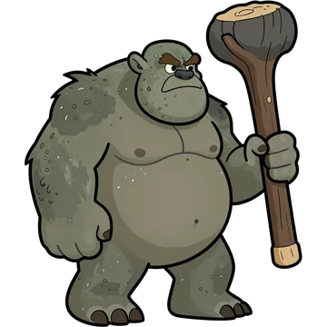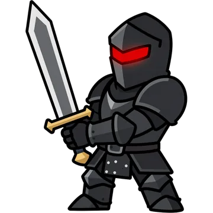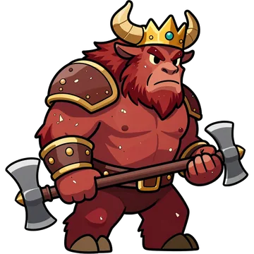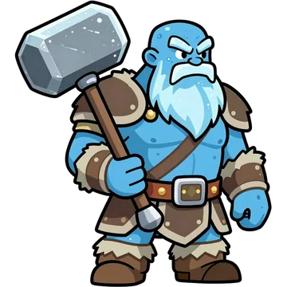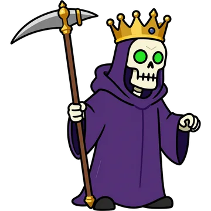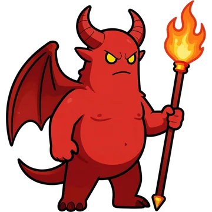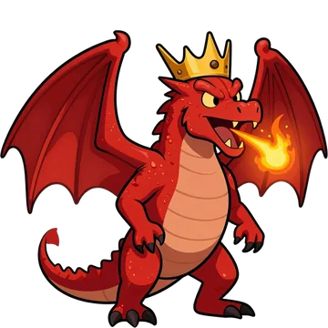
</p>

## Architecture

```
project.godot, scenes/, scripts/     client Godot 4.7 (UI construite en code)
  scripts/api.gd                     HTTP JSON + WebSocket du lobby (reconnexion automatique)
  scripts/updater.gd                 mises à jour : pack .pck téléchargé en arrière-plan, relance --main-pack
  scripts/screens/*.gd               écrans (connexion, cellule, arène, IA, campagne, taverne, combat, passe...)
data/content.json                    contenu partagé client/serveur (héros, armes, compétences, campagne)
server/src/                          serveur Node.js (dépendance unique : ws)
  fight.js                           moteur de combat par équipes, reproductible par graine
  brutes.js, progress.js             brutes, niveaux, IA, boss ; écus, passe, quêtes, cosmétiques
  server.js, store.js                API REST, lobby/salons/amis (WebSocket), stockage JSON atomique
server/deploy/                       unité systemd + snippet nginx (/test-labrute/)
website/                             site vitrine (présentation + téléchargement)
tools/comfy/                         workflows ComfyUI (format API) + générateur d'assets
tools/trailer/                       plans vidéo MiniMax H3 + montage de la bande-annonce
tools/build.py, tools/deploy.py      export Godot (Web, Windows, pack de mise à jour) et déploiement
```

**Mises à jour sans déconnexion** : au redémarrage du serveur (SIGTERM), la base et les salons sont écrits sur disque ;
les clients se reconnectent seuls en ~1 s et retrouvent leur salon. Sur PC, le nouveau `.pck` est téléchargé pendant
la partie puis appliqué au redémarrage choisi par le joueur.

## Assets générés avec ComfyUI

| Type | Modèles | Workflow |
|---|---|---|
| Personnages, boss, familiers, icônes (détourés) | Z-Image Turbo + BiRefNet | `tools/comfy/workflows/sprite.json` |
| Arènes, illustrations, carte | Z-Image Turbo | `tools/comfy/workflows/image.json` |
| Effets sonores | Stable Audio Open 1.0 | `tools/comfy/workflows/sfx.json` |
| Musiques | ACE-Step 1.5 turbo | `tools/comfy/workflows/music.json` |
| Plans de la bande-annonce (vidéo + son) | MiniMax H3 + LoRA turbo | `tools/comfy/workflows/video.json` |

```bash
python tools/comfy/build_manifest.py      # prompts -> manifest.json
python tools/comfy/generate.py            # génère tout ce qui manque (ComfyUI sur 127.0.0.1:8188)
python tools/trailer/gen_clips.py         # plans vidéo de la bande-annonce
python tools/trailer/build_trailer.py     # montage final
```

## Développement

```bash
cd server && npm install && npm test      # test de bout en bout (comptes, combats, amis, salons, redémarrage)
node test/sim.js                          # équilibrage (taux de victoire contre chaque boss)
DATA_DIR=var-local node src/server.js     # serveur local sur 127.0.0.1:8097
godot --path . -- --server=http://127.0.0.1:8097/api
python tools/build.py --all               # build/windows (+ dossier ValorBrawl du bureau), pack de mise à jour
python tools/deploy.py --all --notes="..."  # déploiement (alias SSH configuré localement)
```

Polices : MedievalSharp et Alegreya Sans (SIL Open Font License). Projet de fan inspiré de *La Brute* (Motion Twin).
